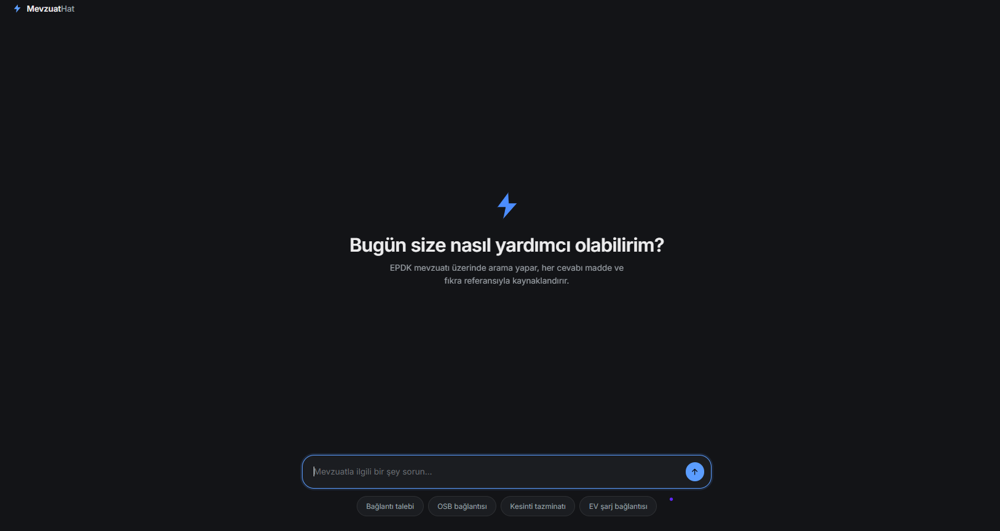
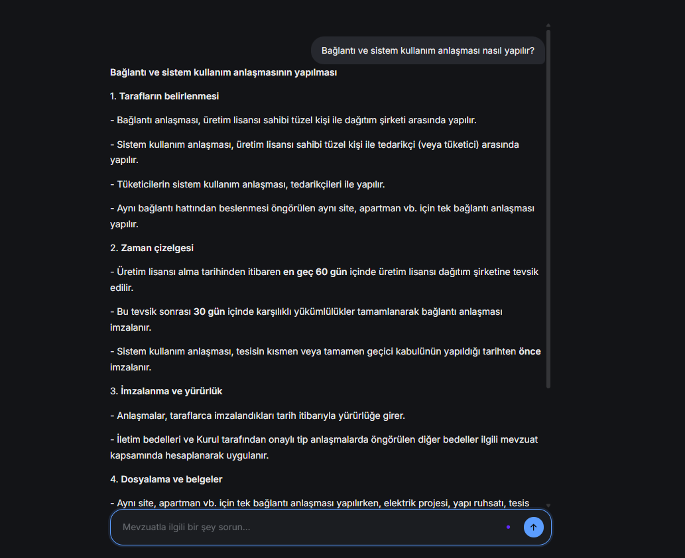

# Elektrik Dağıtım Mevzuat RAG Sistemi

EPDK (Enerji Piyasası Düzenleme Kurumu) mevzuatına kaynak göstererek erişim
sağlayan bir RAG (Retrieval-Augmented Generation) sistemi. Kullanıcının
sorduğu soruyu ilgili kanun/yönetmelik maddeleriyle eşleştirir, madde
numarası ve alıntı göstererek cevap üretir.

> **Not:** Bu sistem bilgilendirme amaçlıdır, hukuki tavsiye niteliği
> taşımaz. Bağlayıcı kararlar için ilgili mevzuatın güncel resmi metnine
> ve/veya bir uzmana başvurun.

## Ekran görüntüleri

| Arayüz | Örnek cevap |
|---|---|
|  |  |

## Pipeline


- **Ingestion:** `src/ingestion/` — kaynak URL listesinden belge indirir,
  her indirmeden önce `robots.txt` kontrolü yapar, SHA-256 hash ile
  `data/raw/manifest.json`'a kaydeder.
- **Parsing:** `src/parsing/` — PDF/DOCX belgelerden madde bazlı yapılandırılmış
  metin çıkarır.
- **Embedding:** `src/embedding/` — `intfloat/multilingual-e5-base` modeliyle
  embedding üretir, Chroma vektör veritabanında saklar.
- **Retrieval:** `src/retrieval/` — BM25 + vektör aramayı birleştiren hibrit
  arama, ardından `cross-encoder/mmarco-mMiniLMv2-L12-H384-v1` ile reranking.
- **Generation:** `src/generation/` — Groq API üzerinden, sadece getirilen
  kaynaklara dayanarak (citation guard ile doğrulanmış) cevap üretir.
- **Tagging:** `src/tagging/` — madde metinlerini senaryo bazlı etiketler.
- **Web:** `web/` — FastAPI backend + statik frontend, sohbet arayüzü.

## Neden RAG, neden dogrudan bir LLM'e sormuyoruz?

Gelistirme surecinde ayni sorulari Gemini, ChatGPT ve DeepSeek'e de sorup
karsilastirdik. Sonuclar, kaynak gosteren bir RAG sisteminin neden gerekli
oldugunu somut ornekerle gosterdi:

**1) Genel modeller tutarsiz olabiliyor.** Ayni soruyu ("baglanti gorusu
gecerlilik suresi kac gun?") farkli oturumlarda ChatGPT'ye sorduk: bir
seferinde dogru cevabi (90 gun, 27 Ocak 2026 degisikligiyle guncellendi)
verdi, baska bir seferinde eski/yanlis bir rakam (60 gun) verdi - ayni
gun, ayni model. MevzuatRag sabit bir kaynaga (indirilen, versiyon
tarihli mevzuat metni) dayandigi icin bu tutarsizlik yapisal olarak
mumkun degil.

**2) Kaynak gosterilmeyince dogrulamak kullaniciya kaliyor.** Gemini ve
DeepSeek genelde dogru cevaplar verdi, ama madde numarasi veya alinti
olmadan - kullanicinin iddiayi ayrica arastirmasi gerekiyor. MevzuatRag
her cevaba madde/fikra numarasi ve resmi metinden birebir dogrulanmis
alinti ekliyor (bkz. `citation_guard.py`), boylece dogrulama sisteme
gomulu.

**3) Az bilinen detaylarda genel modeller bazen bosluk birakiyor.**
"Tedarikci ilk tuketiciyi portfoyune dahil ettiginde sistem kullanim
anlasmasi icin ne zamana kadar basvurmali?" sorusunda DeepSeek dogru
cevabi (ayin onuncu gunu) bulamadi ve kullaniciyi EPDK'ya yonlendirdi;
MevzuatRag ve Gemini dogru cevabi verdi, ama sadece MevzuatRag kaynak
gosterdi.

**4) Belirsiz/celiskili bir soruya verilen tepki fark yaratiyor.**
Kasitli olarak celiskili bir soru sorduk (AG seviyesi + tarimsal
faaliyet - kaynak metinde bu ikisi ayni fikrada gecmiyor). Gemini ve
DeepSeek soruyu sorgulamadan kendinden emin bir cevap verdi. MevzuatRag
ise "dusuk guven" ve "dogrulanamayan alinti" uyarisi verdi - sistem
kendi cevabindaki belirsizligi kullaniciya acikca bildirdi, sessizce
gecistirmedi.

**Ozet:** genel amacli LLM'ler cogu zaman dogru cevap veriyor, ama
*tutarliligi* ve *dogrulanabilirligi* garanti etmiyor. Mevzuat gibi
hukuki baglayiciligi olan, sik degisen bir alanda bu iki ozellik
(tutarlilik + dogrulanabilirlik) RAG mimarisinin asil katma degeri.

## Kurulum

### Yerel (venv)
```bash
python -m venv .venv
source .venv/bin/activate   # Windows: .venv\Scripts\activate
pip install -r requirements.txt
cp .env.example .env        # GROQ_API_KEY gir
```

### Docker
```bash
docker compose up
```
İlk çalıştırmada embedding/reranker modelleri Hugging Face'ten inecek
(birkaç dakika sürebilir); model dosyaları bir Docker volume'ünde
önbelleğe alındığı için sonraki başlatmalarda tekrar inmez.

## Çalıştırma

```bash
python scripts/ingest.py        # mevzuatı indir
python scripts/parse.py         # PDF/DOCX'ten yapılandırılmış metin çıkar
python scripts/build_index.py   # embedding + BM25 index oluştur
python -m uvicorn web.app:app --reload   # web arayüzünü başlat
```
Arayüz: `http://localhost:8000`

## Değerlendirme
```bash
python scripts/run_eval.py
```
Sonuçlar `eval/results.json`'a yazılır.

## Test
```bash
pytest tests/ -v
```

## Bilinen sınırlar
- `src/ingestion/sources.py` içindeki sabit URL listesi kullanılır
  (otomatik mevzuat keşfi yok).
- 4 kaynaktan 2'si (EPDK listeleme sayfası ve bilgi sayfaları) otomatik
  çözümlenmiyor — bkz. `sources.py` içindeki `needs_resolution` notları.
- Coklu kaynak sentezi gerektiren sorularda (orn. iki kavrami
  karsilastirma, tablo olusturma) citation guard bazen bir veya birden
  fazla alintiyi "dogrulanamayan" olarak isaretliyor - model, sentez
  yaparken birebir alintidan paraphrase'e kayabiliyor. Tekil, dogrudan
  madde sorularinda bu sorun gorulmuyor.
- Koşullu/çok kriterli kurallarda (örn. güç esigi + konum birlikte
  degisen degerler) sistem artik bunlari "celiski" olarak yanlis
  etiketlemiyor (bkz. SYSTEM_PROMPT kural 5b/5c), ama bazen bir kosulu
  digerinin ozel hali gibi sunma riski hala tam ortadan kalkmis
  degil - karmasik, 3+ kriterli kurallarda dikkatli okunmali.
- Soru formulasyonuna retrieval performansi hassas olabiliyor; ayni
  konuyu farkli kelimelerle soran ozdes sorular farkli kaynak
  setleri getirebilir.

## Lisans
MIT — bkz. [LICENSE](LICENSE)