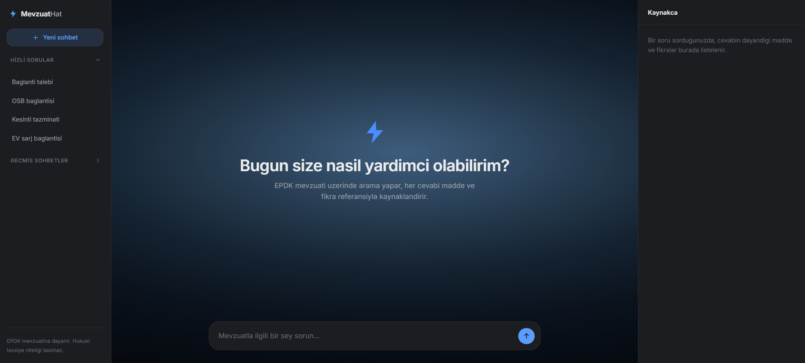
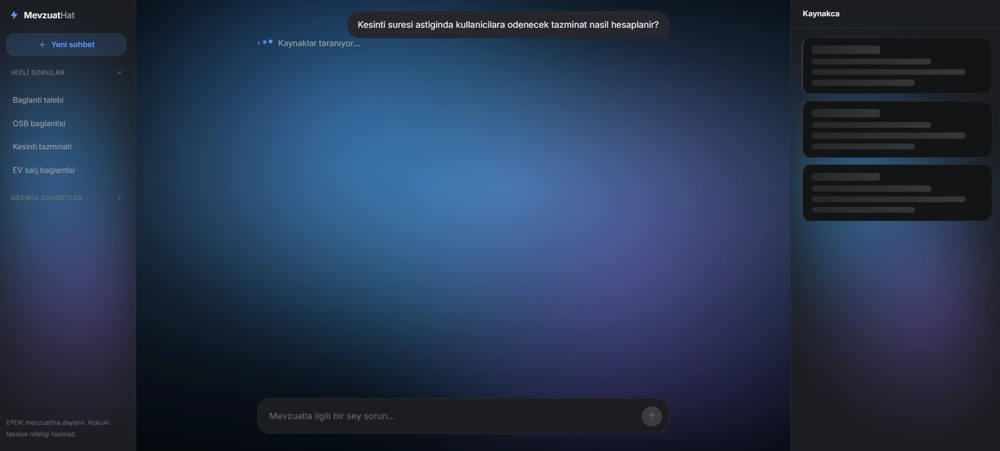
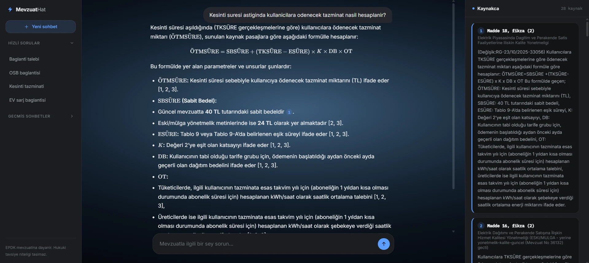
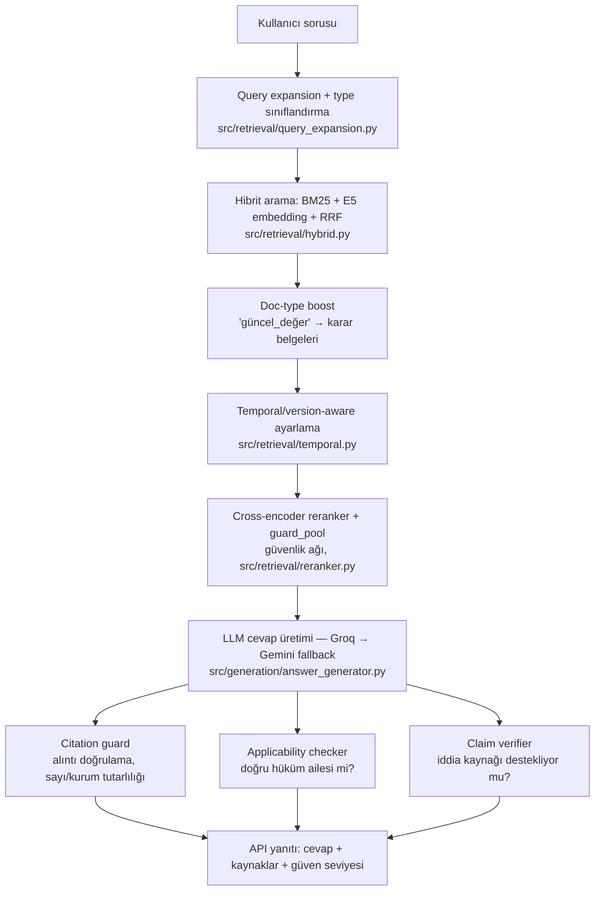

# Elektrik Dağıtım Mevzuat RAG Sistemi

EPDK (Enerji Piyasası Düzenleme Kurumu) mevzuatına kaynak göstererek erişim
sağlayan bir RAG (Retrieval-Augmented Generation) sistemi. Kullanıcının
sorduğu soruyu ilgili kanun/yönetmelik maddeleriyle eşleştirir, madde
numarası ve alıntı göstererek cevap üretir.

> **Not:** Bu sistem bilgilendirme amaçlıdır, hukuki tavsiye niteliği
> taşımaz. Bağlayıcı kararlar için ilgili mevzuatın güncel resmi metnine
> ve/veya bir uzmana başvurun.

## Ekran görüntüleri

| Arayüz | Cevap üretiliyor | Örnek cevap (formül + kaynaklar) |
|---|---|---|
|  |  |  |

## Pipeline


```mermaid
flowchart TD
    A[Kullanıcı sorusu] --> B[Query expansion + type sınıflandırma<br/>src/retrieval/query_expansion.py]
    B --> C[Hibrit arama: BM25 + E5 embedding + RRF<br/>src/retrieval/hybrid.py]
    C --> D[Doc-type boost<br/>'güncel_değer' → karar belgeleri]
    D --> E[Temporal/version-aware ayarlama<br/>src/retrieval/temporal.py]
    E --> F[Cross-encoder reranker + guard_pool<br/>güvenlik ağı, src/retrieval/reranker.py]
    F --> G[LLM cevap üretimi — Groq → Gemini fallback<br/>src/generation/answer_generator.py]
    G --> H[Citation guard<br/>alıntı doğrulama, sayı/kurum tutarlılığı]
    G --> I[Applicability checker<br/>doğru hüküm ailesi mi?]
    G --> J[Claim verifier<br/>iddia kaynağı destekliyor mu?]
    H --> K[API yanıtı: cevap + kaynaklar + güven seviyesi]
    I --> K
    J --> K
```

- **Ingestion:** `src/ingestion/` — kaynak URL listesinden belge indirir,
  her indirmeden önce `robots.txt` kontrolü yapar, SHA-256 hash ile
  `data/raw/manifest.json`'a kaydeder.
- **Parsing:** `src/parsing/` — PDF/DOCX belgelerden madde bazlı yapılandırılmış
  metin çıkarır (madde/fıkra/bent hiyerarşisi, Mülga/Değişik notasyonları).
- **Embedding:** `src/embedding/` — `intfloat/multilingual-e5-base` modeliyle
  embedding üretir, FAISS vektör indeksinde saklar.
- **Retrieval:** `src/retrieval/pipeline.py` — tek bir ortak pipeline (hem
  web hem eval tarafından kullanılır): query expansion → hibrit arama
  (BM25 + dense + RRF) → doc-type boost (güncel-değer sorularında Kurul
  Kararı belgelerini önceliklendirir) → temporal/version-aware ayarlama
  (aynı yönetmeliğin farklı tarihli versiyonları arasında sorudaki tarihe
  göre seçim) → `cross-encoder/mmarco-mMiniLMv2-L12-H384-v1` ile reranking
  + guard_pool güvenlik ağı (reranker'ın gözden kaçırdığı güçlü hibrit
  sonuçlarını geri ekler).
- **Generation:** `src/generation/` — Groq API (Gemini fallback) üzerinden,
  sadece getirilen kaynaklara dayanarak cevap üretir; üç bağımsız doğrulama
  katmanı ile denetlenir:
  - `citation_guard.py` — alıntıların kaynakta birebir var olup olmadığını,
    sayısal/kurumsal tutarlılığı deterministik (regex) olarak kontrol eder.
  - `applicability_checker.py` — alıntı doğru olsa bile, kullanılan hükmün
    sorudaki SPESİFİK senaryoya gerçekten uygulanıp uygulanmadığını (doğru
    hüküm ailesi mi) ayrı bir LLM çağrısıyla denetler.
  - `claim_verifier.py` — cevaptaki her iddiayı kaynağından ayrıştırıp,
    iddianın kaynaktan daha güçlü/farklı bir şey söyleyip söylemediğini
    (entailment) kontrol eder.
- **Tagging:** `src/tagging/` — madde metinlerini senaryo bazlı etiketler.
- **Web:** `web/` — FastAPI backend + statik frontend, sohbet arayüzü.
- **Evaluation & experiment tracking:** `scripts/run_eval.py` — Recall@K
  (K=1/3/5/10), MRR, citation groundedness, latency metriklerini ölçer;
  her koşu otomatik olarak MLflow'a (`mlflow.db`, sqlite backend) bir run
  olarak kaydedilir — bkz. [Değerlendirme](#değerlendirme).

## Neden RAG, neden dogrudan bir LLM'e sormuyoruz?

Gelistirme surecinde ayni sorulari Gemini, ChatGPT ve DeepSeek'e de sorup
karsilastirdik. Sonuclar, kaynak gosteren bir RAG sisteminin neden gerekli
oldugunu somut ornekerle gosterdi:

**1) Genel modeller tutarsiz olabiliyor.** Ayni soruyu ("baglanti gorusu
gecerlilik suresi kac gun?") farkli oturumlarda ChatGPT'ye sorduk: bir
seferinde dogru cevabi (90 gun, 27 Ocak 2026 degisikligiyle guncellendi)
verdi, baska bir seferinde eski/yanlis bir rakam (60 gun) verdi - ayni
gun, ayni model. MevzuatRag sabit bir kaynaga (indirilen, versiyon
tarihli mevzuat metni) dayandigi icin bu tutarsizlik yapisal olarak
mumkun degil.

**2) Kaynak gosterilmeyince dogrulamak kullaniciya kaliyor.** Gemini ve
DeepSeek genelde dogru cevaplar verdi, ama madde numarasi veya alinti
olmadan - kullanicinin iddiayi ayrica arastirmasi gerekiyor. MevzuatRag
her cevaba madde/fikra numarasi ve resmi metinden birebir dogrulanmis
alinti ekliyor (bkz. `citation_guard.py`), boylece dogrulama sisteme
gomulu.

**3) Az bilinen detaylarda genel modeller bazen bosluk birakiyor.**
"Tedarikci ilk tuketiciyi portfoyune dahil ettiginde sistem kullanim
anlasmasi icin ne zamana kadar basvurmali?" sorusunda DeepSeek dogru
cevabi (ayin onuncu gunu) bulamadi ve kullaniciyi EPDK'ya yonlendirdi;
MevzuatRag ve Gemini dogru cevabi verdi, ama sadece MevzuatRag kaynak
gosterdi.

**4) Belirsiz/celiskili bir soruya verilen tepki fark yaratiyor.**
Kasitli olarak celiskili bir soru sorduk (AG seviyesi + tarimsal
faaliyet - kaynak metinde bu ikisi ayni fikrada gecmiyor). Gemini ve
DeepSeek soruyu sorgulamadan kendinden emin bir cevap verdi. MevzuatRag
ise "dusuk guven" ve "dogrulanamayan alinti" uyarisi verdi - sistem
kendi cevabindaki belirsizligi kullaniciya acikca bildirdi, sessizce
gecistirmedi.

**Ozet:** genel amacli LLM'ler cogu zaman dogru cevap veriyor, ama
*tutarliligi* ve *dogrulanabilirligi* garanti etmiyor. Mevzuat gibi
hukuki baglayiciligi olan, sik degisen bir alanda bu iki ozellik
(tutarlilik + dogrulanabilirlik) RAG mimarisinin asil katma degeri.

## Kurulum

### Yerel (venv)
```bash
python -m venv .venv
source .venv/bin/activate   # Windows: .venv\Scripts\activate
pip install -r requirements.txt
cp .env.example .env        # GROQ_API_KEY gir
```

### Docker
```bash
docker compose up
```
İlk çalıştırmada embedding/reranker modelleri Hugging Face'ten inecek
(birkaç dakika sürebilir); model dosyaları bir Docker volume'ünde
önbelleğe alındığı için sonraki başlatmalarda tekrar inmez.

## Çalıştırma

```bash
python scripts/ingest.py        # mevzuatı indir
python scripts/parse.py         # PDF/DOCX'ten yapılandırılmış metin çıkar
python scripts/build_index.py   # embedding + BM25 index oluştur
python -m uvicorn web.app:app --reload   # web arayüzünü başlat
```
Arayüz: `http://localhost:8000`

## Değerlendirme

```bash
python scripts/run_eval.py                              # sadece retrieval (hızlı)
python scripts/run_eval.py --with-generation             # + cevap üretimi/citation guard
python scripts/run_eval.py --sample 30 --with-generation # dengeli bir alt küme ile hızlı ölçüm
```
Sonuçlar `eval/results.json`'a yazılır. Her koşu ayrıca otomatik olarak
MLflow'a (sqlite backend, `mlflow.db`) loglanır — parametre/model
denemelerini (reranker, embedding modeli, `FINAL_TOP_K` vb.) karşılaştırmak
için:
```bash
mlflow ui --backend-store-uri sqlite:///mlflow.db
```

### Güncel sonuçlar

**Retrieval (N=92, tam eval seti, sadece retrieval — `scripts/run_eval.py`, hukuki-token BM25 tokenizer'ı ile):**

| Metrik | Değer |
|---|---:|
| Recall@1 | 39.5% |
| Recall@3 | 74.4% |
| Recall@5 | 84.9% |
| Recall@10 (final top-K) | 91.9% |
| MRR | 0.601 |
| MRR@5 | 0.588 |
| MRR@10 | 0.598 |
| Ortalama retrieval gecikmesi | 7.6s |

**Generation (N=30, dengeli örneklem, `--with-generation` — `scripts/run_eval.py --sample 30 --with-generation`):**

| Metrik | Değer |
|---|---:|
| Citation groundedness | 90.8% |
| Ortalama generation gecikmesi | 13.0s |
| Negative test başarısı | 50% (N=2 — küçük örneklem, tek başına güvenilir değil) |

Negative test başarı oranı burada retrieval skoruna dayanıyor
(`correct_low_confidence`); canlı sistemde gerçek üretim davranışı
(`guard_low_confidence`, citation_guard'ın asıl ürettiği sinyal) kullanılır
ve genelde daha yüksek çıkar — bkz. `scripts/run_eval.py` içindeki
`summarize()` yorumu. Recall@1'in görece düşük olması (retrieval'in
"doğru maddeyi bulması" ile "ilk sıraya koyması" arasındaki fark) hâlâ
açık bir iyileştirme alanı; sistem çoğu zaman doğru maddeyi buluyor ama
onu her zaman en üste taşıyamıyor.

### Denenen iyileştirmeler (MLflow'da kayıtlı)

Hepsi aynı 92 soruluk set üzerinde ölçüldü; "kazanmayan" denemeler de bilerek
kayıtta bırakıldı:

| Deney | Sonuç | Karar |
|---|---|---|
| Reranker: `bge-reranker-v2-m3` (MiniLM yerine) | Recall@10 91.9→94.2%, ama Recall@1/MRR iyileşmedi, retrieval **9x yavaş** (9s→79s) | Reddedildi |
| Embedding (alt-küme, dense-only): `bge-m3`, `e5-large` vs `e5-base` | Recall@1 76.7→79.1%, MRR 0.862→0.88 (86 soruda ~2 soru farkı), 3-4x yavaş | — |
| Embedding (tam pipeline, `raw-` belgesiz indeks): `bge-m3` vs `e5-base` | `bge-m3` **daha kötü**: Recall@1 58.1% vs 61.6%, MRR 0.697 vs 0.722 | `e5-base`'te kalındı |
| Adaptive query expansion (güvenli görünen sorularda expansion'ı atla) | Orijinal 46 soruda Recall@8 95.7→84.8%: rerank skoru "doğru pasaj mı" için güvenilir bir sinyal değil | Geri alındı |
| BM25 hukuki tokenizer (`10/A`, `EK MADDE 5`, tarihler) | Recall@1 38.4→39.5%, MRR 0.596→0.601 (küçük kazanç, zarar yok) | Tutuldu |

**Önemli gözlem:** Korpusun yaklaşık %57'si toplu içe aktarılmış `raw-*`
belgelerden oluşuyor. Bu belgeler dense indeksten çıkarıldığında Recall@1
%39.5 → %61.6'ya çıkıyor: sıralama kalitesindeki asıl darboğaz model seçimi
değil, korpus içindeki benzer/ilgisiz belgelerin rekabeti. Belgeler bilinçli
olarak korpusta tutuluyor; bu, açık bir iyileştirme alanı olarak duruyor.

*Metin açıklaması: Recall@K, beklenen madde/belgenin reranker'ın ilk K
sonucunda bulunma oranı. "Negative test" soruları, kaynak metinde cevabı
OLMAYAN sorulardır — başarı ölçütü burada TERS çevrilir: sistemin
"bulamadım" demesi (düşük güven) başarı sayılır. Tam metodoloji için
`scripts/run_eval.py`'nin başındaki docstring'e bakın.*

## Test
```bash
pytest tests/ -v
```

## Bilinen sınırlar
- Coklu-kurum (TEIAS / dagitim sirketi / EPDK gibi) icerikli sorularda, model bazen farkli kurumlari birbirinin esanlamlisi gibi sunabiliyor (orn. "dagitim sirketi (TEIAS)"). Kod seviyesinde bir tespit mekanizmasi (detect_institution_conflation) bu durumlarda otomatik dusuk guven tetikliyor, ama icerik yine de dikkatli okunmali - ozellikle teknik/operasyonel (SCADA, set-point, PPC gibi) konularda.
- `src/ingestion/sources.py` içindeki sabit URL listesi kullanılır
  (otomatik mevzuat keşfi yok).
- 4 kaynaktan 2'si (EPDK listeleme sayfası ve bilgi sayfaları) otomatik
  çözümlenmiyor — bkz. `sources.py` içindeki `needs_resolution` notları.
- Coklu kaynak sentezi gerektiren sorularda (orn. iki kavrami
  karsilastirma, tablo olusturma) citation guard bazen bir veya birden
  fazla alintiyi "dogrulanamayan" olarak isaretliyor - model, sentez
  yaparken birebir alintidan paraphrase'e kayabiliyor. Tekil, dogrudan
  madde sorularinda bu sorun gorulmuyor.
- Koşullu/çok kriterli kurallarda (örn. güç esigi + konum birlikte
  degisen degerler) sistem artik bunlari "celiski" olarak yanlis
  etiketlemiyor (bkz. SYSTEM_PROMPT kural 5b/5c), ama bazen bir kosulu
  digerinin ozel hali gibi sunma riski hala tam ortadan kalkmis
  degil - karmasik, 3+ kriterli kurallarda dikkatli okunmali.
- Soru formulasyonuna retrieval performansi hassas olabiliyor; ayni
  konuyu farkli kelimelerle soran ozdes sorular farkli kaynak
  setleri getirebilir.
- Her soru artik 3 ayri LLM cagrisi gerektirebiliyor (cevap uretimi +
  applicability_checker + claim_verifier) - bu, dogruluk/guvenilirlik
  icin bilincli bir tercih (defense in depth), ama gecikme ve API
  maliyetini artiriyor. "Adaptive query expansion" (ilk-gecis skoruna
  gore expansion'i atlama) bu maliyeti azaltmak icin denendi ama
  ampirik olarak terk edildi - bkz. `src/retrieval/pipeline.py`
  docstring'i.
- Recall@1 (%39.5) ile Recall@10 (%92) arasindaki fark, sistemin dogru
  maddeyi COGUNLUKLA buldugunu ama onu HER ZAMAN ilk sıraya
  tasiyamadigini gosteriyor - siralama kalitesi (reranker/embedding
  modeli secimi) bir sonraki buyuk iyilestirme alani.

## Lisans
MIT — bkz. [LICENSE](LICENSE)